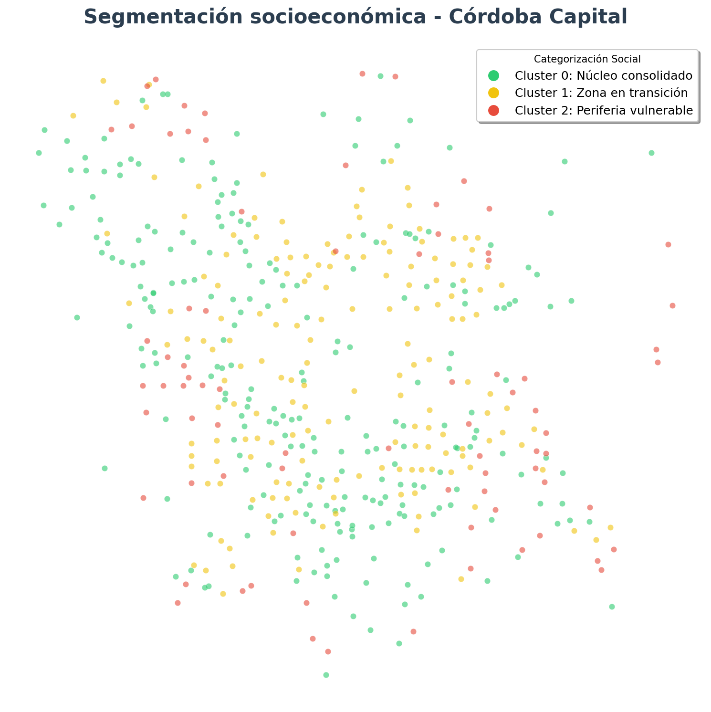
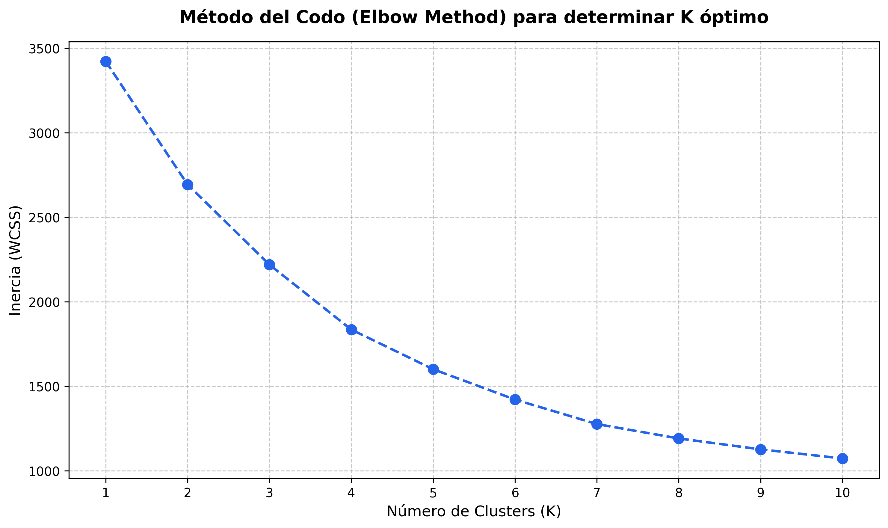
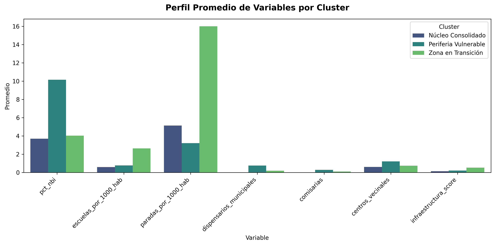
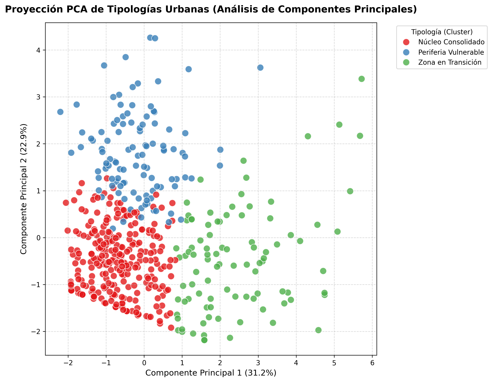
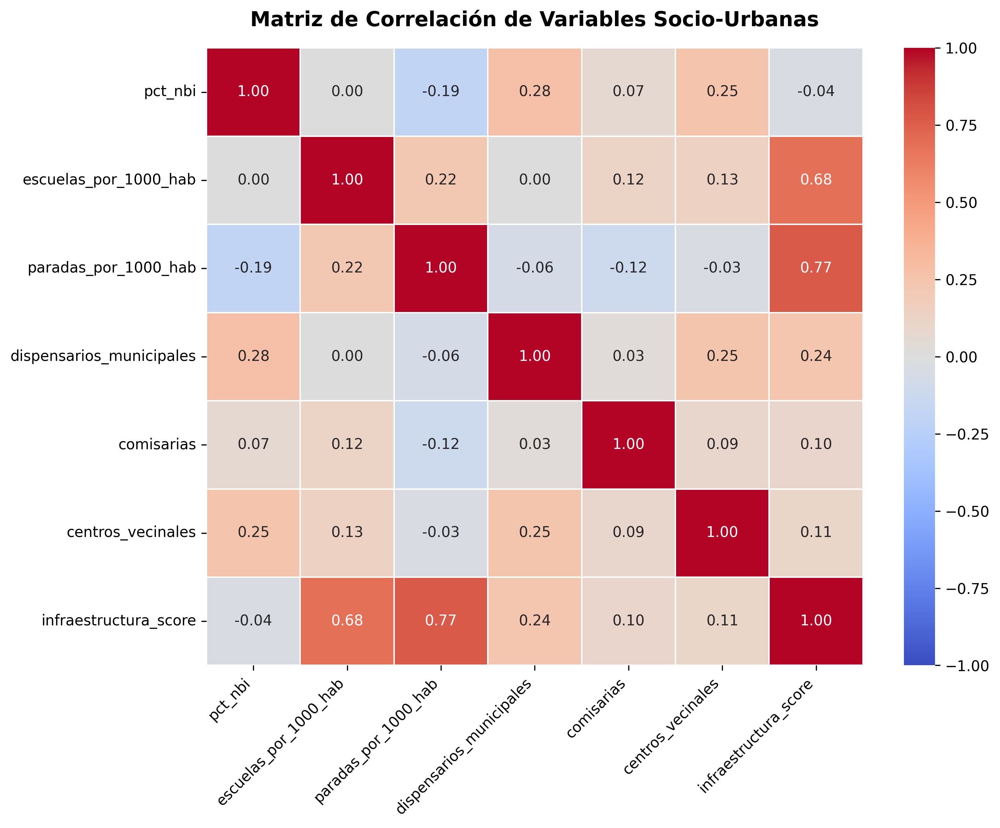
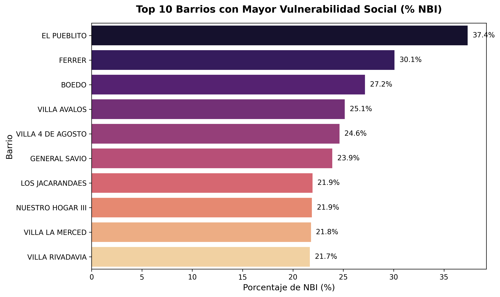

# 🏙️ Identificación de tipologías urbanas en Córdoba mediante datos abiertos y clustering

<p align="center">
  <a href="figures/mapa_clusters_pro.html">
    
  </a>
  <br>
  <i>Mapa estratégico de tipologías urbanas: Segmentación barrial basada en infraestructura y vulnerabilidad social.</i>
  <br>
  <b>[ 🗺️ CLIC AQUÍ PARA ABRIR EL MAPA INTERACTIVO ](figures/mapa_clusters_pro.html)</b>
</p>

---

## 🌐 Dashboard Interactivo (Live Demo)

> [!IMPORTANT]
> **Explora los resultados de forma interactiva y en tiempo real:**
> ### 🔗 [https://dashboard-desigualdad-cordoba.vercel.app](https://dashboard-desigualdad-cordoba.vercel.app)
> *Navega directamente sobre el mapa de la ciudad para visualizar la huella geoespacial de cada barrio, sus clústeres y el equipamiento urbano detallado.*

---

## 📝 Descripción del problema

El crecimiento de las ciudades suele ser asimétrico, generando zonas con profundas carencias estructurales que conviven con otras de alta consolidación urbana. Este proyecto nace como un **caso de estudio pedagógico y profesional** diseñado para explorar, medir y clasificar la desigualdad territorial en la ciudad de Córdoba Capital (Argentina) utilizando herramientas modernas de Ciencia de Datos.

A través del cruce de datos estructurales de pobreza histórica (NBI del Censo Nacional) con el despliegue moderno de infraestructura de servicios públicos (gestión municipal), este repositorio permite aplicar algoritmos de Machine Learning para detectar patrones de segregación y construir perfiles urbanos que faciliten la toma de decisiones basada en evidencia.

## ❓ Preguntas de investigación

1. ¿Qué barrios de Córdoba Capital presentan el mayor grado de vulnerabilidad socioeconómica y déficit de infraestructura?
2. ¿Existe una relación matemática clara entre los niveles de pobreza estructural (NBI) y la escasez de acceso a servicios como salud, educación y transporte?
3. ¿Es posible identificar **tipologías urbanas** (clústeres naturales) que agrupen a los barrios de forma objetiva sin intervención subjetiva humana?

## 📊 Dataset

La investigación se sustenta en un ecosistema de datos consolidado a partir de fuentes GIS y bases tabulares oficiales:
* **Unidad de análisis:** Barrios de la ciudad de Córdoba Capital.
* **Cantidad:** **495 unidades territoriales**. Esta cifra representa el nomenclador consolidado para este estudio, garantizando consistencia espacial (aunque puede variar levemente según la fuente cartográfica).
* **Variables clave:** 
  * Necesidades Básicas Insatisfechas (% NBI)
  * Infraestructura Educativa (Escuelas provinciales y municipales)
  * Transporte Público (Paradas y recorridos de colectivos)
  * Salud y Seguridad (Centros de salud, comisarías, luminaria pública)
  * Tejido Social (Centros vecinales e infraestructura comunitaria)

## 🚀 Mejoras recientes

Como parte del proceso de mejora continua del proyecto, se han incorporado las siguientes actualizaciones:
* **Validación Estadística:** Implementación del *Silhouette Score* para evaluar la cohesión de los grupos, asegurando que la separación entre barrios similares y diferentes sea estadísticamente sólida.
* **Optimización Visual:** Refinamiento estético de los mapas y el gráfico de PCA (Análisis de Componentes Principales) para facilitar la interpretación de los clústeres.
* **Integración Incremental:** Mejoras en el pipeline de datos que permiten actualizaciones modulares sin alterar la lógica de negocio ni la arquitectura original del proyecto.

## 🗃️ Fuentes de Datos

Este proyecto consolida información proveniente de portales de datos abiertos de alta transparencia:

* **[IDECOR (Infraestructura de Datos Espaciales de Córdoba)](https://www.idecor.gob.ar/)**: Cartografía oficial de barrios e infraestructura educativa.
* **[Portal de Gobierno Abierto - Municipalidad de Córdoba](https://gobiernoabierto.cordoba.gob.ar/data/)**: Datos sobre transporte (MoviBus), salud municipal y centros vecinales.
* **[INDEC (Instituto Nacional de Estadística y Censos)](https://www.indec.gob.ar/)**: Datos demográficos y de pobreza estructural a nivel de radio censal.

## 🛠️ Metodología

El proyecto propone un *pipeline* profesional y reproducible:

1. **Limpieza y Estandarización:** Tratamiento de fuentes heterogéneas, manejo de nulos y normalización de nomenclaturas.
2. **Integración Geoespacial:** Uso de *GeoPandas* y algoritmos de proximidad (*KD-Tree*) para asignar equipamiento a polígonos barriales.
3. **Feature Engineering:** Creación de indicadores por densidad poblacional para comparaciones equitativas.
4. **Normalización:** Ajuste de escalas para que todas las variables tengan el mismo peso relativo en el modelo.
5. **Clustering (K-Means):** Agrupamiento automático de barrios según similitud multidimensional.
6. **Optimización de Clusters:** Uso del *Método del Codo* para determinar el balance ideal entre complejidad y precisión.

<p align="center">
  
  <br>
  <i>Insight: El método del codo nos permite identificar visualmente que K=3 es el punto de equilibrio óptimo para capturar la varianza de la ciudad.</i>
</p>

## 📈 Resultados

El modelo sugiere la existencia de 3 perfiles urbanos diferenciados:

1. **Núcleo Consolidado (Cluster 0):** Áreas con servicios plenos y mínimos niveles de pobreza estructural.
2. **Zona en Transición (Cluster 1):** Sectores periurbanos con infraestructura variable y niveles medios de vulnerabilidad.
3. **Periferia Vulnerable (Cluster 2):** Aglomeraciones con alta criticidad social y déficit acentuado de presencia estatal.

### Tabla de Perfiles (Promedios)
| Cluster | % NBI | Escuelas (x1000) | Paradas (x1000) | Score Infra. |
|:---|---:|---:|---:|---:|
| Núcleo Consolidado | 2.83 | 0.58 | 5.06 | 0.15 |
| Zona en Transición | 3.90 | 2.68 | 15.96 | 0.54 |
| Periferia Vulnerable | 14.14 | 0.81 | 3.40 | 0.17 |

<p align="center">
  
</p>

## 🖼️ Visualizaciones Analíticas

### Reducción de Dimensionalidad (PCA)
<p align="center">
  
  <br>
  <i>Insight: Este gráfico demuestra cómo los barrios se separan claramente en tres grupos según su perfil socio-urbano, validando la lógica del clustering.</i>
</p>

### Mapa de Calor - Correlaciones
<p align="center">
  
  <br>
  <i>Insight: Revela la relación directa entre el acceso a transporte y educación con el nivel de vulnerabilidad de los barrios.</i>
</p>

### Sectores de Alta Criticidad
<p align="center">
  
  <br>
  <i>Insight: Identificación prioritaria de las zonas que requieren intervención urgente en obra pública y servicios sociales.</i>
</p>

## ⚠️ Limitaciones del análisis

* **Temporalidad:** Cruce de datos de distintas fechas (Censo vs. Catastro contemporáneo).
* **Correlación no es Causalidad:** El modelo muestra asociaciones, no necesariamente causas únicas.
* **Modelo Simplificado:** K-Means asume formas de clústeres ideales que pueden simplificar la realidad urbana compleja.

## 📈 Posibles mejoras

* **Visualización Choropleth:** Implementar mapas de polígonos interactivos para una lectura geográfica más precisa.
* **Nuevas Variables:** Integrar datos de ingresos promedio por hogar y frecuencias de transporte en tiempo real.
* **Arquitectura Full-Stack:** Integración total del pipeline con el frontend en React para un dashboard dinámico.

## 📂 Estructura del repositorio

```text
dataset-desigualdad-cordoba/
├── data/
│   ├── raw/                  # Datasets crudos originales
│   └── processed/            # Datasets transformados listos para análisis
├── notebooks/                
│   ├── 01_limpieza.ipynb     # Depuración y limpieza de datos
│   ├── 02_analisis.ipynb     # Análisis descriptivo visual
│   └── 03_modelado.ipynb     # Entrenamiento de algoritmos de ML
├── scripts/                  # Código Python modular y reproducible
├── figures/                  # Gráficos y salidas definitivas
├── requirements.txt          # Dependencias del entorno
└── README.md                 # Documentación principal
```

## ⚙️ Cómo ejecutar

1. **Clonar el repositorio:**
   ```bash
   git clone https://github.com/eber-cba/dataset-desigualdad-cordoba.git
   ```
2. **Instalar dependencias:**
   ```bash
   pip install -r requirements.txt
   ```
3. **Ejecutar el pipeline:**
   Puedes abrir los Notebooks en la carpeta `/notebooks` o ejecutar los scripts integradores en `/scripts` para regenerar el dataset final.

---
**Desarrollado con compromiso por la Ciencia de Datos orientada al impacto social.**
