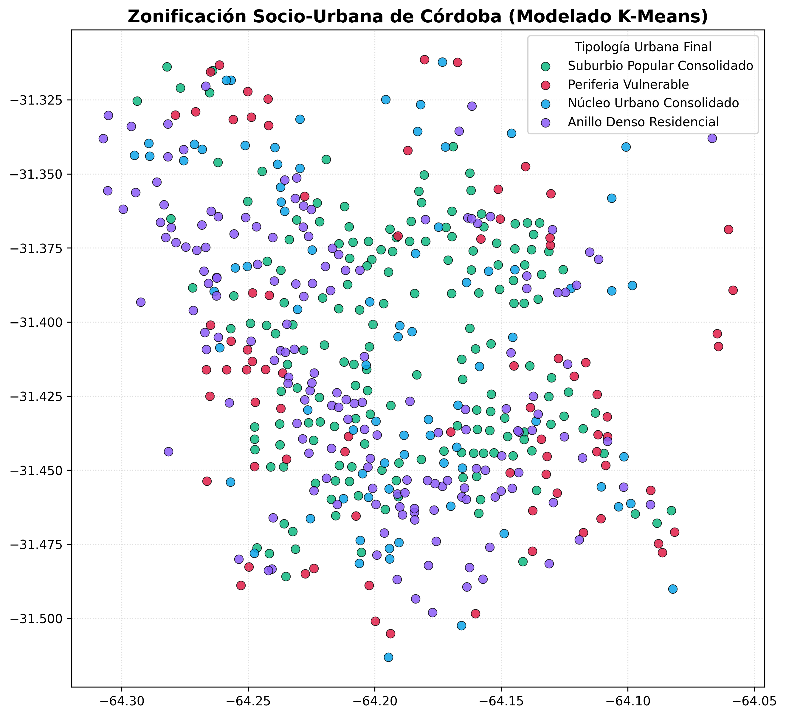
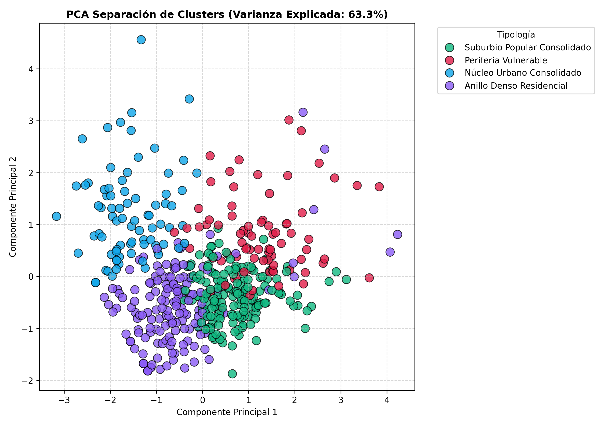
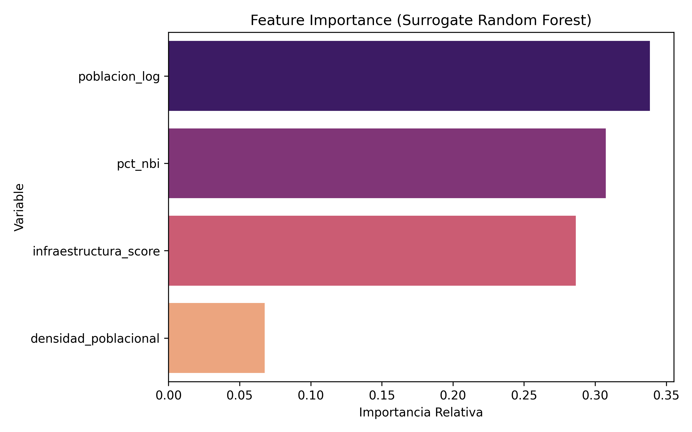

# 🏙️ Urban Data Science: Desigualdad y Análisis Espacial de Córdoba 🇦🇷

**🚀 Proyecto candidato para la Convocatoria a Mentorías DiploDatos FAMAF 2026.**

Este repositorio consolida un proyecto avanzado de **Ciencia de Datos y Análisis Geoespacial** enfocado en los 495 barrios de la ciudad de Córdoba Capital. 

El objetivo principal de este proyecto es medir matemáticamente la vulnerabilidad y la desigualdad urbana, cruzando datos demográficos reales de pobreza (NBI) con el acceso a infraestructura pública (escuelas, centros de salud, luminarias y transporte público).

## 📌 ¿Por qué este Dataset? (El Propósito)
Las políticas públicas suelen diseñarse basándose en intuición. Este ecosistema de datos permite a analistas y estudiantes aplicar algoritmos de Machine Learning para responder preguntas clave con rigor científico:
* ¿Afecta más a la pobreza la falta de escuelas o la falta de transporte?
* ¿Cómo se agrupa la ciudad si dejamos que un modelo de Inteligencia Artificial dibuje las fronteras socioeconómicas sin mirar un mapa?
* ¿Dónde deberíamos invertir el presupuesto de obra pública el año próximo?

## 🧑‍🎓 Uso para Estudiantes y Académicos
El repositorio está diseñado bajo una arquitectura modular (Pipeline). Acompaña al alumno desde la limpieza de datos más simple hasta predicciones complejas, pasando por:
1. **Análisis Exploratorio (EDA):** Detección de patrones y mapeo interactivo de la ciudad.
2. **Aprendizaje No Supervisado (Clustering):** Algoritmos como `K-Means` y `DBSCAN` para descubrir "Perfiles Urbanos" ocultos en la estadística.
3. **Aprendizaje Supervisado (Machine Learning):** Modelos predictivos (como Random Forest) que calculan el impacto del entorno en la calidad de vida de los habitantes.

## 📊 Visualizaciones Analíticas
### Reducción de Dimensionalidad (PCA)
Comprimiendo múltiples variables de la ciudad en un plano 2D para entender visualmente la segregación barrial.

### Midiendo el Impacto (Feature Importance)
Utilizamos algoritmos para descifrar cuál es la variable de infraestructura que más peso tiene sobre la desigualdad.

## 📦 Outputs Definitivos del Proyecto
El pipeline procesa toneladas de datos crudos (Censos y GIS) y genera archivos limpios listos para consumir:

- `dataset_ml_v19.csv`: El archivo estrella. Datos depurados, listos para que los estudiantes entrenen modelos.
- `dataset_dashboard_v19.csv`: Datos ideados para inyectar en herramientas de Business Intelligence (PowerBI/Tableau) o Dashboards Web.
- `dataset_gis_v19.geojson`: Polígonos y métricas listas para renderizar mapas reales.
- `mapa_interactivo_clusters_v19.html`: Mapa de calor explorable (Folium) 100% interactivo.

---
**Desarrollado y Auditado con fines educativos y de investigación urbana pública.**
