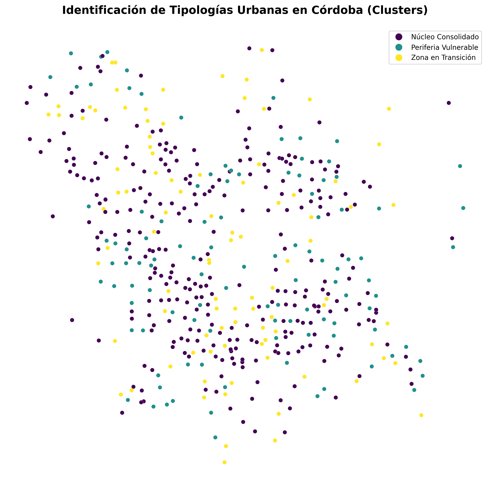

# Identificación de tipologías urbanas en Córdoba mediante datos abiertos y clustering

<p align="center">
  
</p>

## Descripción del problema

El crecimiento de las ciudades muchas veces ocurre de manera desigual, generando zonas con profundas carencias estructurales que conviven con otras de alta consolidación urbana. Este proyecto busca **resolver el problema de la medición y clasificación de la desigualdad territorial** en la ciudad de Córdoba Capital (Argentina). 

Las políticas públicas y la planificación urbana requieren herramientas precisas que no dependan únicamente de la intuición o la experiencia empírica. Cruzando datos estructurales de pobreza histórica (NBI del Censo Nacional) con el despliegue moderno de infraestructura a nivel de servicios públicos (gestión municipal 2023), esta investigación aplica algoritmos de clustering para detectar patrones ocultos de segregación, creando perfiles que puedan guiar la toma de decisiones basada en *Data Science*.

## Preguntas de investigación

1. ¿Qué barrios de Córdoba Capital presentan un mayor grado de vulnerabilidad socioeconómica y déficits de infraestructura?
2. ¿Existe una relación matemática comprobable entre los niveles de pobreza estructural (NBI) y la escasez de acceso a servicios básicos como salud, educación, transporte y seguridad?
3. ¿Se pueden identificar **tipologías urbanas** (clústeres naturales) que agrupen a los barrios bajo características comunes sin la intervención subjetiva humana?

## Dataset

La investigación se sustenta en un ecosistema de datos cruzados obtenidos a partir del cruce espacial de archivos GIS y bases tabulares:
* **Unidad de análisis:** Los barrios oficiales de la ciudad de Córdoba Capital.
* **Cantidad:** **495 barrios** seleccionados. Esta suma cubre el total oficial garantizando rigor estadístico.
* **Variables incluidas:** 
  * Necesidades Básicas Insatisfechas (% NBI)
  * Infraestructura Educativa (Escuelas provinciales y municipales)
  * Transporte Público (Paradas y recorridos de colectivos)
  * Salud y Seguridad (Dispensarios, comisarías, luminaria pública)
  * Centros Vecinales (Tejido social e infraestructura ciudadana comunitaria)

## Metodología

El proyecto fue concebido bajo un *pipeline* integral de Data Science, asegurando la reproducibilidad de todos sus pasos:

1. **Recolección y Limpieza de datos:** Se procesaron múltiples fuentes (GeoJSON, archivos CSV históricos) lidando con valores nulos, georeferencias erróneas y unificación de nombres de barrios topográficamente irregulares.
2. **Integración Geoespacial:** Se utilizó *GeoPandas* para el cálculo de distancias (K-Nearest Neighbors espaciales) e intersecciones (Points in Polygon) asignando escuelas y paradas de colectivos al dominio de un barrio.
3. **Feature Engineering:** Se crearon métricas relativas que permitieran comparaciones justas, tales como *“Luminarias por cada 1000 habitantes”* o *“Índices de Cobertura Educativa”*. Se construyó un **Score de Infraestructura**.
4. **Normalización:** Las variables fueron estandarizadas asumiendo media 0 y varianza 1 mediante `StandardScaler()` para impedir que las de mayor rango dimensional dominaran sobre el resto.
5. **Clustering Predictivo (K-Means):** Se entrenó un modelo de particionamiento supervisado para la creación de divisiones latentes de la ciudad.
6. **Selección de K (Elbow Method):** Para evitar el sesgo en el agrupamiento, se usó el *Método del Codo*, justificando matemáticamente la división de Córdoba en 3 tipologías principales de acuerdo a la estabilización de su inercia.

<p align="center">
  
</p>

## Resultados

El modelo K-Means identificó y etiquetó de manera no supervisada la estructura latente de Córdoba Capital, exponiendo 3 perfiles urbanos definidos:

1. **Núcleo Consolidado (Cluster 0):** Áreas (usualmente el centroide, zonas norte y barrios residenciales históricos) con los más bajos niveles de necesidades estructurales y una altísima aglomeración de servicios públicos, transporte fluido y presencia estatal.
2. **Zona en Transición (Cluster 1):** Un anillo periurbano o de segunda corona, donde se observan contrastes. La infraestructura comienza a disminuir de manera gradual, mostrando niveles medios de NBI y una distribución desigual en educación o luminaria. 
3. **Periferia Vulnerable (Cluster 2):** Aglomeraciones de alta criticidad social. Son sectores que quedaron profundamente aislados de la densificación estatal. Tienen un déficit acentuado de escuelas base, ausencia notoria de comisarías/dispensarios municipales, y los números más alarmantes de pobreza estructural de la Capital.

<p align="center">
  
</p>

## Visualizaciones

A continuación se exponen resultados visuales extra que refuerzan el entendimiento de la matriz general poblacional para las variables estudiadas.

### Reducción de Dimensionalidad y Fronteras (PCA)

<p align="center">
  
</p>

### Mapa de Calor - Correlaciones Cruzadas

<p align="center">
  
</p>

### Sectores Críticos (Vulnerabilidad Extrema)

<p align="center">
  
</p>

## Conclusiones

Este análisis de *Urban Data Science* permite llegar a múltiples insights determinantes:
* La hipótesis de desigualdad territorial en Córdoba se verifica matemáticamente como un modelo de conformación **Centro-Periferia**. Los servicios no logran capilaridad en los bordes de la mancha urbana.
* Existe una fuerte correlación negativa estadísticamente comprobada (Heatmap) entre el \% de NBI y las métricas de infraestructura o densidad del transporte público. "La pobreza habita allí donde la accesibilidad del transporte público falla".
* El modelo permite a las comunas observar con precisión qué barrios necesitan un presupuesto inmediato, sustituyendo la asignación al azar por una enfocada al cierre real y predictivo de la brecha territorial.

## Estructura del repositorio

```text
dataset-desigualdad-cordoba/
├── data/
│   ├── raw/                  # Datasets crudos extraídos originalmente de diversas fuentes
│   └── processed/            # Datasets transformados y unificados listos para IA & EDA
├── notebooks/                
│   ├── 01_limpieza.ipynb     # Proceso de depuración, limpieza de nulos y estandarización
│   ├── 02_analisis.ipynb     # Análisis descriptivo exploratorio visual sobre la población
│   └── 03_modelado.ipynb     # Entrenamiento de algoritmos no supervisados y Machine Learning
├── scripts/                  # Código Python reproducible y encapsulado en módulos
├── figures/                  # Imágenes, plots y salidas geográficas definitivas de reportes
├── requirements.txt          # Dependencias y bibliotecas vitales del entorno Python
└── README.md                 # Informe y documentación del proyecto
```

## Cómo ejecutar

1. Realiza el clone del repositorio a tu disco duro local:
```bash
git clone https://github.com/eber-cba/dataset-desigualdad-cordoba.git
```
2. Instala las dependencias estipuladas dentro del entorno virtual usando `pip`:
```bash
pip install -r requirements.txt
```
3. Navega hacia el directorio de análisis y comienza ejecutar utilizando Jupyter o tu IDE predeterminado:
```bash
jupyter notebook notebooks/01_limpieza.ipynb
```
